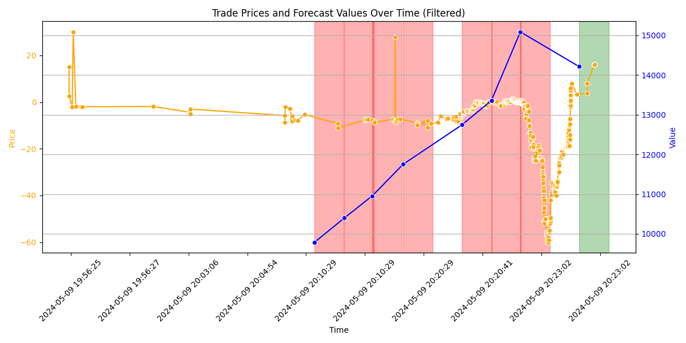

# Initial idea

- Get data from RTE for predicted solar energy
- Visualize the data, to get an indication of the idea of the trader

## Problem statement
One of our Traders suspects that whenever the solar production figures increase significantly in a short time span it’s a selling opportunity for the next hour spot delivery, and vice versa. If the figures of the production tank, the spot contract should be bought.
(up is a overproduction in the net and with overproduction we expect the price to go down, and with a shortage the price to go up.)

### Validation
There are two ways to help validate this hypothesis.

1. Validate if there is a trend upwards (thats why sell) in prices within an hour and if there is a decrease in price when production suddenly decrease.
2. Given the task, the optimal trading pattern can be found using the inventory management problem with deterministic
inventory control. Normally also can account for trading costs. Does this trading pattern of buying and selling within these periods overlap?

The first is quick to validate, can probably be done visually but statistically is better. However given the requirements of creating the idea, visualizing seems good enough.
However, there is a difference in working and good. We can also use the optimal trading pattern to validate any algorithm we create, and have a benchmark to validate any model.

### Possible problems
My main note, is that we only validate on 1 day of information, it can be an indication, however, this is no validation. Working with one day of data can be an accidental coincidence, and since this trading idea is supposed to run year round, we need to know if this works in all periods.
Generally in electricity trading, differences of solar effecting prices are possibly higher in summer. Trading differentials are thus essentials, since solar is summer is higher in winter, it takes a larger share in production. 
Thus deviations in production have more effect during summer due too its larger share of total produced electricity.
This effect could also show differently, and we have more trading opportunities in summer than in winter. This should all be validated, before fully deploying such a system, coming from a lack of a large timeframe of the data.

However, since this is just for the assignment, I will ignore this problem to show the solutions.
## RTE collection (Scrapped)
Collect large timeframes (1 year) to validate the idea of the trader
with a change of 500 MWh from forecast to forecast will suffice to constitute a trading opportunity." as an description, I expect that the different types of forecast types provided in the RTE documentation 
https://data.rte-france.com/documents/20182/224298/EN_GU_API_Generation_Forecast_v02.01.00.pdf
is meant as forecast to forecast where 
- `CURRENT:` Represents the current forecast.
- `ID:` Represents an intraday forecast for the current day.
- `D-1:` Represents a day-ahead forecast for tomorrow.
- `D-2:` Represents a day-ahead forecast for the day after tomorrow.
- `D-3:` Represents a day-ahead forecast for three days from today.

Initial reading in the RTE application to find all required resources took 2 hours. Some of it was spent to just play around with the available data, which was fun. 

In authentication, there is documentation of the source simple example code which took 1h to get it to work.
The actual data retrievel took another 1 to get it to work.

## After questioning
It appeared that I did not receive sufficient information on the project, and thus the RTE data collection is scrapped.

## Hypothesis (1H)
Initial visualization of the hypothesis:
We show all changes in expected production prices, over the contract price with corresponding sell and buy periods, where green represents buy, and red a sell.

However, for a larger data set, his would not be viable to validate, and you have to take the groupings of change, and validate if there is indeed significant change in prices in case of such an event.

From this we can see that there is not a lot of correspondence in prices and changes.
Even worse if there is, it seems to be the opposite of what we have expected where the largest buy period was after an increase, and the best sell period was after an increase only accounting in periods of changes.
However, since we only use a day of information we can not confirm nor deny this. Therefor, we either have to gather more information, or create a new hypothesis, before we continue to model.

## Optimal model (3h)
To get the optimal trading model we can use finite-horizon dynamic programming with deterministic inventory control
Assuming the price in the trade file being the price per MW, we calculated the optimal trade pattern to be in profit by 12597 with a total trade action of 1126 assuming no costs.
However, this is the optimal and not traded. With a large set of optimal choices and a data set to decide our actions with, we can learn an algorithm that takes values such as changes in weather patters, changes in predicted consumption.
This model should again be validated with a validation set.
The idea of changes in solar output are still valid, but should be checked with larger datasets,

Further more on the inbalance market (which is based on missing/overflow of electricity production), it does not make sense to correlate the total production to price, since it deviates to a lack or surplus.
Therefor the basic idea of sudden missing solar output seems to be a good idea to further check with a larger dataset.
Other possibilities are flow analysis of electricity between countries, sudden changes in production of electricity etc, could be good ideas to look at.

## Hours
1. Documentation 1 hour
2. Visualization 1 hour
3. RTE exploration 2 hours
4. Logging in RTE 1 hour
5. Data gathering RTE 1 hour
6. Optimal model 3 hours